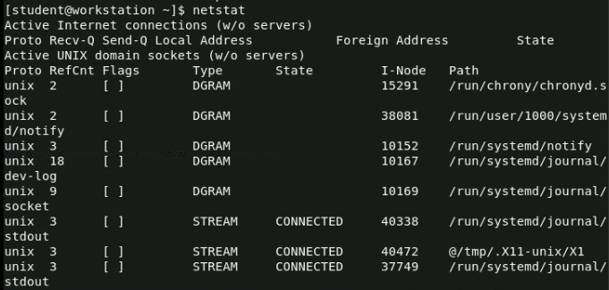

# 50 Command Linux menggunakan RedHat

## Penjelasan tentang command pada linux
Perintah atau command pada sistem operasi Linux adalah instruksi yang diberikan melalui antarmuka baris perintah (command-line interface) untuk menjalankan tugas-tugas tertentu atau mengakses berbagai fitur sistem. Command pada Linux sangat fleksibel dan memberikan kontrol yang tinggi kepada pengguna untuk berinteraksi dengan sistem.

## Command
#### 1. `ls` "Menampilkan daftar file dan direktori."

#### 2. `date` "Menampilkan Tanggal dan Waktu Sekarang."

#### 3. `man systemctl` "Digunakan untuk menampilkan manual atau dokumentasi."

#### 4. `sudo su` "Digunakan untuk beralih ke akun pengguna superuser atau root."

#### 5. `exit` "Digunakan untuk menutup terminal."

#### 6. `id` "Menampilkan informasi tentang identitas pengguna."

#### 7. `ifconfig` "Menampilkan informasi antarmuka jaringan."

#### 8. `hostname -I` "Digunakan untuk menampilkan alamat IP yang terkait dengan host atau sistem."

#### 9. `whoami` "Menampilkan nama pengguna saat ini."

#### 10. `netstat` "Digunakan untuk menampilkan informasi berbagai aspek koneksi jaringan pada sistem Linux."

#### 11. `ping google.com` "Menguji koneksi jaringan."

#### 12. `help` "Digunakan untuk menampilkan bantuan atau petunjuk singkat terkait dengan perintah yang dijalankan di dalam shell bash."

#### 13. `cd "nama file"` "Digunakan untuk berpindah dari satu direktori ke direktori lain di dalam sistem file."

#### 14. `cd -` "Kembali ke direktori induk (parent directory)."

#### 15. `mkdir` "Membuat direktori baru."

#### 16. `rmdir` "Menghapus direktori kosong."

#### 17. `ssh student@servera` "Cara untuk melakukan koneksi ke server dengan menggunakan protokol Secure Shell (SSH)."

#### 18. `lab start logs-preserve` "Untuk mengecek lab system"

#### 19. `sudo -i` "Digunakan untuk membuka sesi shell interaktif dengan hak istimewa superuser (root)."

#### 20. `sudo adduser user` "Digunakan untuk menambahkan pengguna baru ke sistem."

#### 21. `sudo nano "nama file"` "Digunakan untuk membuka teks editor nano dengan hak akses superuser (root). "
 

#### 22. `pwd` "Menampilkan direktori kerja saat ini."

#### 23. `w` "Menampilkan informasi pengguna yang sedang masuk dan aktivitas mereka."

#### 24. `sudo gedit "nama file"` "Digunakan untuk membuka teks editor Gedit dengan hak akses superuser (root)."
 

#### 25. `sudo systemctl reboot` "Me-restart sistem."
 

#### 26. `ps` "Menampilkan proses yang berjalan."

#### 27. `passwd` "Mengganti kata sandi pengguna."

#### 28. `who` "Menampilkan pengguna yang sedang masuk."

#### 29. `uptime` "Menampilkan informasi waktu aktif sistem."

#### 30. `crontab` "Menjadwalkan tugas-tugas yang akan dijalankan secara berkala."

#### 31. `lsof` "Menampilkan file yang sedang digunakan oleh proses."

#### 32. `ps aux` "Menampilkan daftar semua proses yang sedang berjalan."

#### 33. `du` "Menampilkan penggunaan disk suatu direktori."

#### 34. `locate "nama file"` "Mencari file dalam database lokal."

#### 35. `df` "Menampilkan informasi penggunaan disk."

#### 36. `find "nama file"` "Mencari file atau direktori."

#### 37. `cal` "Menampilkan kalender."

#### 38. `dig` "Menampilkan informasi DNS."

#### 39. `top`

#### 40. `free` "Menampilkan penggunaan memori."

#### 41. `route` "Menampilkan dan mengonfigurasi routing tabel."

#### 42. `history` "Menampilkan riwayat perintah shell."

#### 43. `useradd -D` "Digunakan untuk melihat atau mengonfigurasi default untuk pembuatan pengguna baru di sistem Linux."

#### 44. `killall -V` "Digunakan untuk menampilkan informasi versi perangkat lunak (version) dari perintah tersebut."

#### 45. `timedatectl` "Perintah pada sistem operasi Linux yang digunakan untuk mengonfigurasi dan menampilkan informasi waktu dan tanggal sistem."

#### 46. `timedatectl list-timezones` "Menampilkan daftar zona waktu yang tersedia."

#### 47. `timedatectl set-timezone "zona waktu yang kalian inginkan"` "Mengganti zona waktu sistem dengan yang diinginkan."

#### 48. `fg` "Mengembalikan proses dari latar belakang ke depan."

#### 49. `bg` "Mengirim proses ke latar belakang."

#### 50. `lsblk` "Menampilkan informasi blok perangkat penyimpanan."

