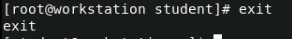

# 50 Command Linux menggunakan RedHat

#### 1. `ls`

#### 2. `date`

#### 3. `man systemctl`

#### 4. `sudo su`

#### 5. `exit`

#### 6. `id`

#### 7. `ifconfig`

#### 8. `hostname -I`

#### 9. `whoami`

#### 10. `netstat`

#### 11. `ping google.com`

#### 12. `help`

#### 13. `cd "nama file"`

#### 14. `cd -`

#### 15. `mkdir`

#### 16. `rmdir`

#### 17. `ssh student@servera`

#### 18. `lab start logs-preserve`

#### 19. `sudo -i`

#### 20. `sudo adduser user`

#### 21. `sudo nano "nama file"`
 

#### 22. `pwd`

#### 23. `w`

#### 24. `sudo gedit "nama file"`
 

#### 25. `sudo systemctl reboot`
 

#### 26. `ps`

#### 27. `passwd`

#### 28. `who`

#### 29. `uptime`

#### 30. `crontab`

#### 31. `lsof`

#### 32. `ps aux`

#### 33. `du`

#### 34. `locate "nama file"`

#### 35. `df`

#### 36. `find "nama file"`

#### 37. `cal`

#### 38. `dig`

#### 39. `top`

#### 40. `free`

